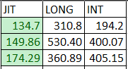
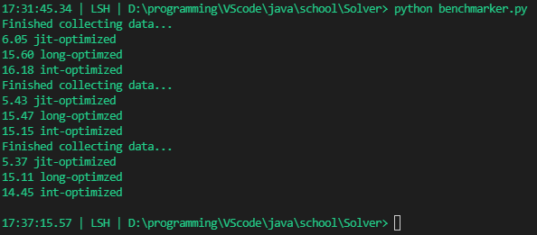

# Solver
This is a small project for a mathematical "problem"  
I already was able to solve the "problem" with a little program:
```Java
public static void main(String[] args) {
    for(int i = 9; i <= 100_000_000; i+=10) {
        boolean is = true;
        for(int j = 2; j <= 10; j++) {
            if(!((i % j) >= (j / 2))) { is = false; }
        }
        if(is) { System.out.println(i);}
    }
}
```

# The Problem
Find the smallest number where following conditions are true:  
When dividing the number from all numbers from 2 to 10 the remainder of the division has to be larger then half of the divisor  

Check in Python:  
```Python
def isGood(num : int):
    good : bool = True
    for i in range(2, 10+1):
        if !(num % i >= i/2):
            good = False
    return good
```

# Optimization
For a big increase in efficiency the program doesn't calculate the half of the numbers from 2 to 10 (or in advanceder versions of the program from 2 to n) but instead uses a table of pre-computed half's of the numbers.  

Example of such table ranging from 2 to 100 which means it contains all half's of the numbers 2 to 201:
```Java
private static int[] halfLUT = {
1, 2, 2, 3, 3, 4, 4, 5, 5, 6, 6, 7, 7, 8,8, 9, 9, 10, 10, 11, 11, 12, 12, 13, 13, 14, 14, 15, 15, 16, 16, 17, 17, 18, 18, 19, 19, 20, 20, 21, 21, 22, 22, 23, 23, 24, 24, 25, 25, 26, 26, 27, 27, 28, 28, 29, 29, 30, 30, 31, 31, 32, 32, 33, 33, 34, 34, 35, 35, 36, 36, 37, 37, 38, 38, 39, 39, 40, 40, 41, 41, 42, 42, 43, 43, 44, 44, 45, 45, 46, 46, 47, 47, 48, 48, 49, 49, 50, 50, 51, 51, 52, 52, 53, 53, 54, 54, 55, 55, 56, 56, 57, 57, 58, 58, 59, 59, 60, 60, 61, 61, 62, 62, 63, 63, 64, 64, 65, 65, 66, 66, 67, 67, 68, 68, 69, 69, 70, 70, 71, 71, 72, 72, 73, 73, 74, 74, 75, 75, 76, 76, 77, 77, 78, 78, 79, 79, 80, 80, 81, 81, 82, 82, 83, 83, 84, 84, 85, 85, 86, 86, 87, 87, 88, 88, 89, 89, 90, 90, 91, 91, 92, 92, 93, 93, 94, 94, 95, 95, 96, 96, 97, 97, 98, 98, 99, 99, 100, 100
};
```

Another optimization used is the way that for loops are used, in the highly optimized versions of this program the main for-loop will travers from end to beginning and not like normally from beginning to end.
This will speed up runtime of the program slightly.

# JIT-Optimization
## What even is JIT?
**JIT** stands for **J**ust **I**n **T**ime and in the context of Java is the Just In Time Compiler, as you may know Java isn't a compiled language and gets interpreted on run time.
But as you may know from pure interpreted languages like python performance is not that great, that's why java has the JIT-Compiler its a smart compiler that will compile the code during run time and even make changes to it so it will run faster.  

## How is it used here?
The more advancer `Long-JIT-Optimized` Solver is a good example of JIT optimization.  
In this use case we can see that the program will not run directly but instead calls a function before running:
```Java
private static void jitWarmup(long start1, long start2, long end1, long end2, int lineBufSize) {
    Random rmd = new Random();
    for (int i = 0; i < 51; i++) {
        long start = (long) rmd.nextInt((int) start2 - (int) start1) + start2;
        long stop = (long) rmd.nextInt((int) end2 - (int) end1) + end2;
        stop = lastDigit9(stop);
        Util.disablePrintingGlobaly();
        calculate(start, stop, true, lineBufSize);
        calculate(start, stop, false, lineBufSize);
        Util.enablePrintingGlobaly();
        System.out.println((i * 2) + "% ");
    }
}
```
As you can see this function will run the main calculation function 50 times with random arguments and printing disabled.
This is so because this allows the JVM(**J**ava **V**irtual **M**achine) to call the JIT-Compiler which then can compile our code in a more efficient way. The printing is disabled because it will clutter our output and removes the time it takes to print so the warmup only takes about 1-3 sek.

# Speed comparison
The data for this was created using the `benchmark.py` script!  
In this current state the program consist of 4 different solver-modes:
```
0. Old                 Old implementation of solver
1. Long-JIT-Optimized  A long solver with optimization and JIT warmup functionality
2. LongOptimized       Long-based version of solver with optimization
3. IntOptimized        Integer-based version of solver with optimization
```
The question you now may ask is which one is the fastest and best?  
After many runs of the benchmark script and even more time spent in excel I was able to compile the data down to this:  


This data was obtained by running the benchmark script 3 times with different setting.
An example of such benchmark output:  


## Summary
**As excepted the JIT-Optimized long solver is the fastest.**  
Often the int based solver will be faster than the normal long solver this is the case because the long solver is intended for values that are bigger then the int limit of `2,147,483,647`.

# Goals
My goals with this project are making the program as fast as possible and also learning how to use git and GitHub in a productive way!
